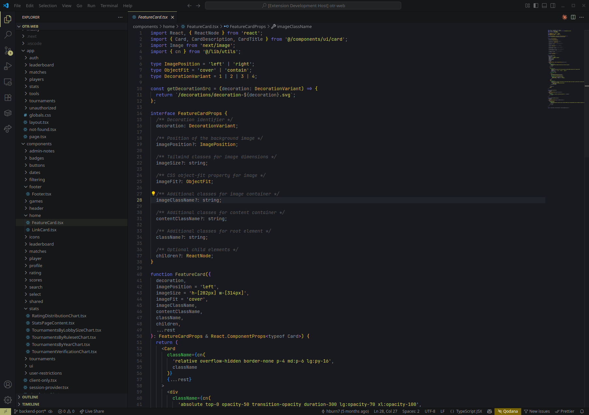
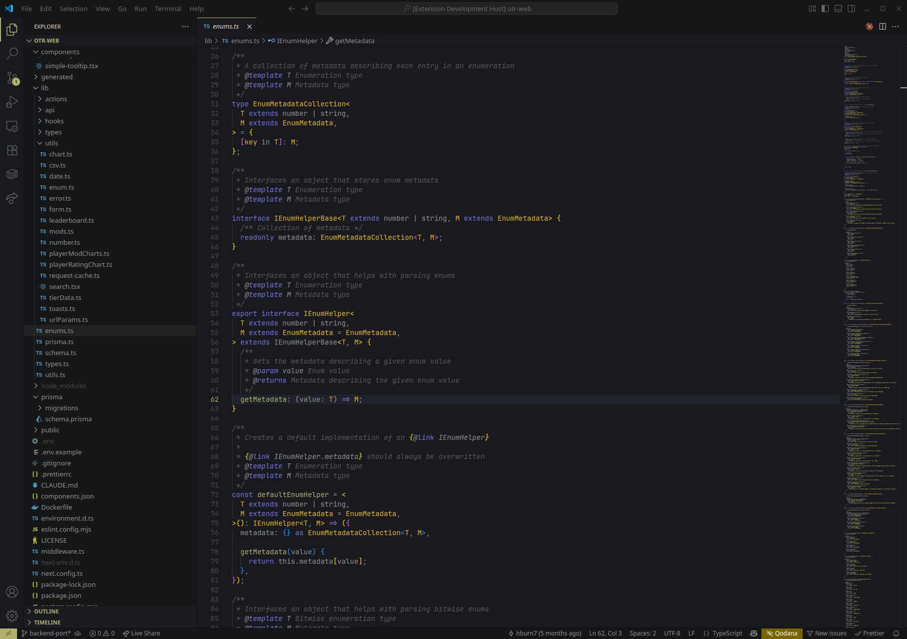
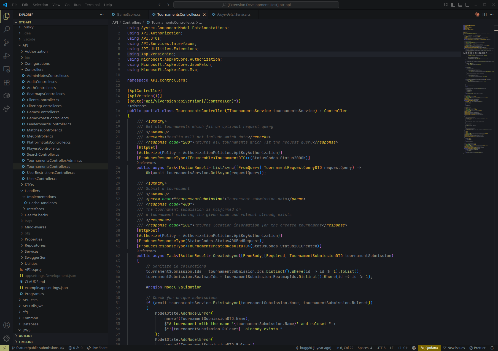
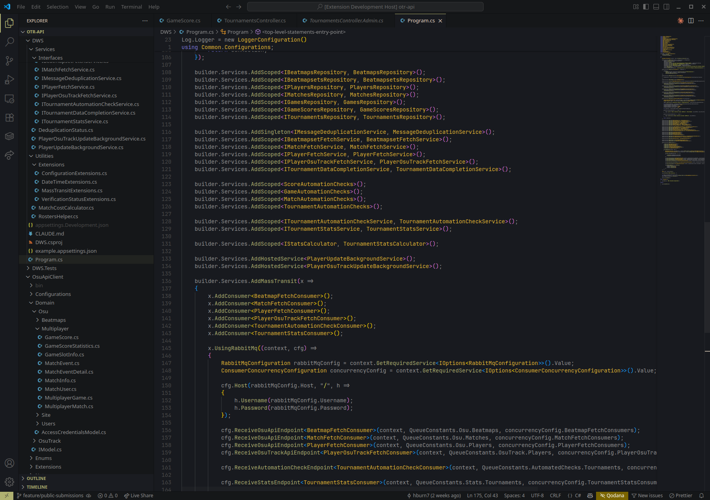
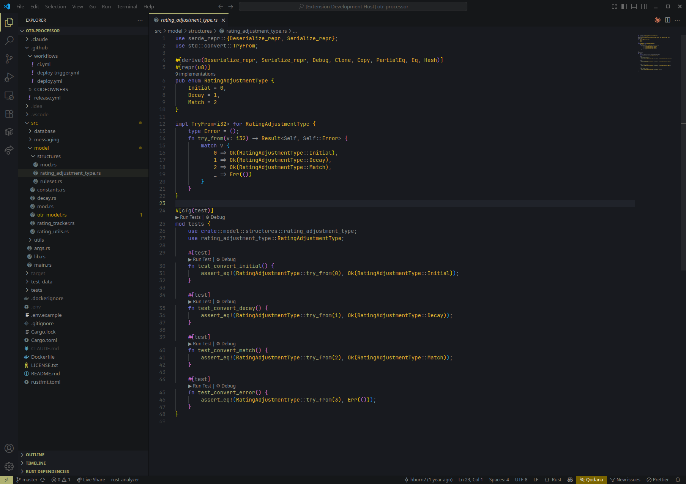
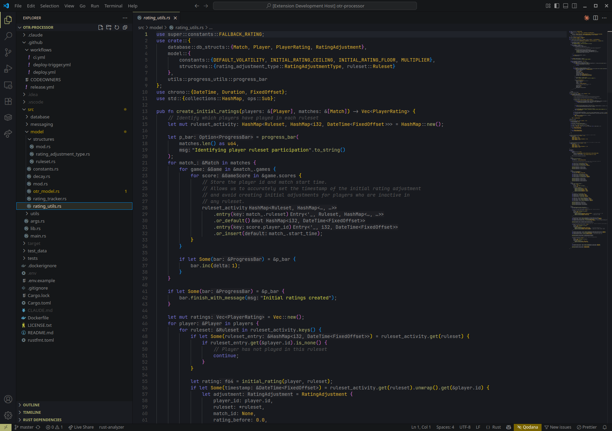
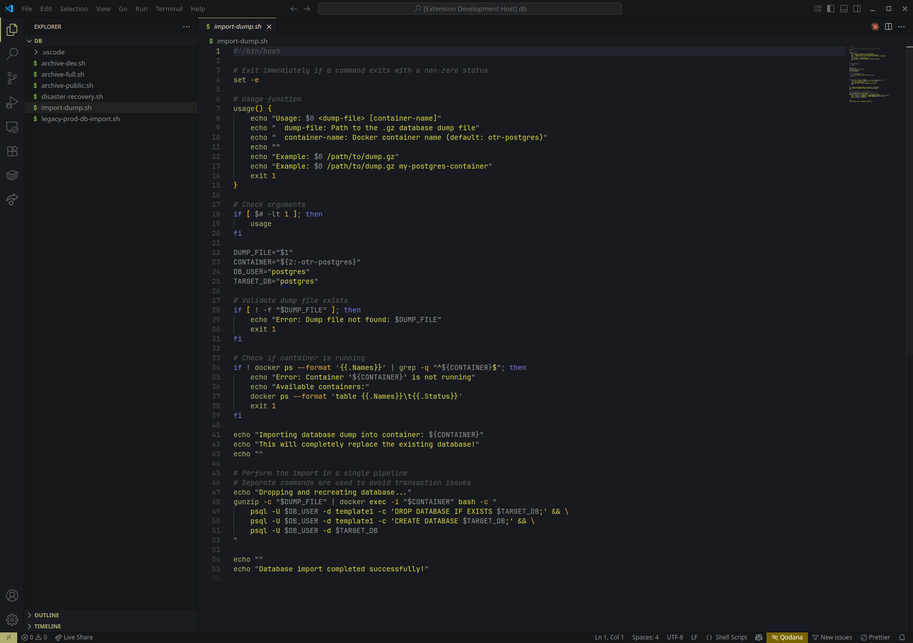

# Curtain Call

An elegant dark theme that's easy on the eyes.

## Installation

1. Open VS Code
2. Go to Extensions (Ctrl+Shift+X / Cmd+Shift+X)
3. Search for "Curtain Call"
4. Click Install

## Usage

1. Open Command Palette (Ctrl+Shift+P / Cmd+Shift+P)
2. Type "Color Theme"
3. Select "Curtain Call" from the list
4. Enjoy!

## License

MIT

## Screenshots

### TypeScript

### C\#

### Rust

### Shell

